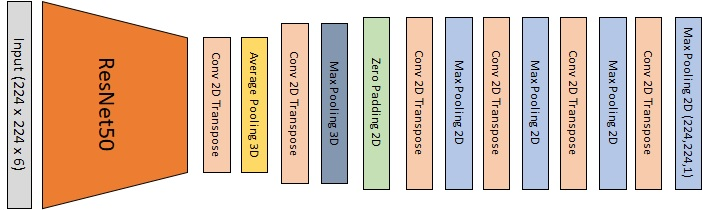
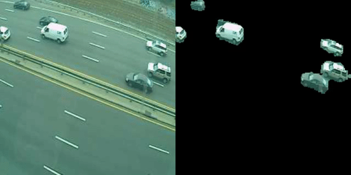

# Change Detection #

### Author: Angelo Antonio Manzatto ###

-------------------------------------
### Problem ###

Detecting changing areas in videos or sequence of images is an important field in computer vision. Example applications includes:

* Video surveillance
* Anomaly detection 
* Parking occupancy detection
* Object tracking
* Measure traffic flow
* Fall detection
* Patrol national borders

-------------------------------------
### Task ###

Develop a complete solution using Convolutional Neural Networks to extract the background from an image.

The following pipeline was adopted for this project:

* Download selected database from CDNET.
* Create dataset.
* Create data augmentations techniques for pre processing steps.
* Create model (ResNet50 + Decoder)
* Train model.
* Evaluate model.
* Test a batch of samples not previously seen by the model.

-------------------------------------
### Model ###

For this project I used a ResNet model with a peculiar decoder process. Instead of the tradicional Conv2D + UpSampling I used an Average Pooling 3D and a MaxPooling 3D to compress the output channels and then expanded the others using a Conv2D Transposed.

-------------------------------------
### Results ###

Here is the final result of the applied trained model on a validation set.

-------------------------------------

This project was made using as reference Change Detection Net (CDNET):
Link: http://jacarini.dinf.usherbrooke.ca/
 
Article of Reference:
Y. Wang, P.-M. Jodoin, F. Porikli, J. Konrad, Y. Benezeth, and P. Ishwar, CDnet 2014: 
An Expanded Change Detection Benchmark Dataset, in Proc. IEEE Workshop on Change Detection (CDW-2014) at CVPR-2014, pp. 387-394. 2014